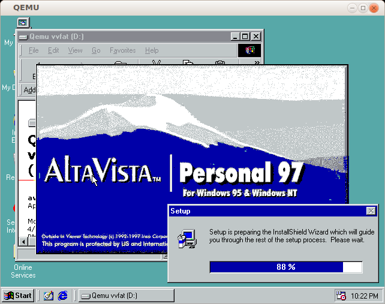
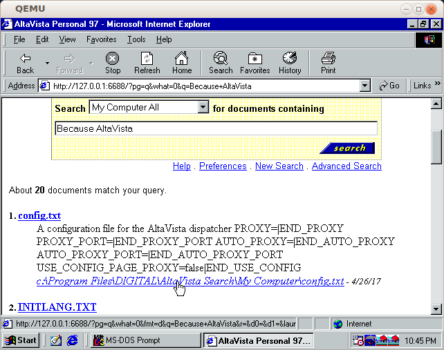
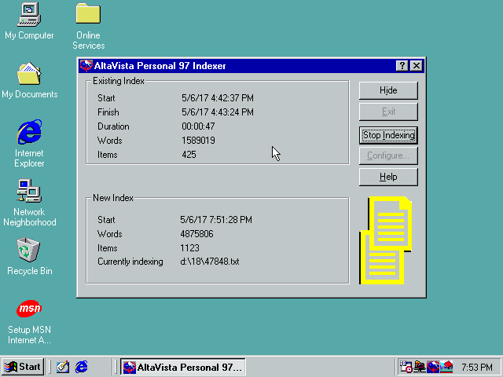
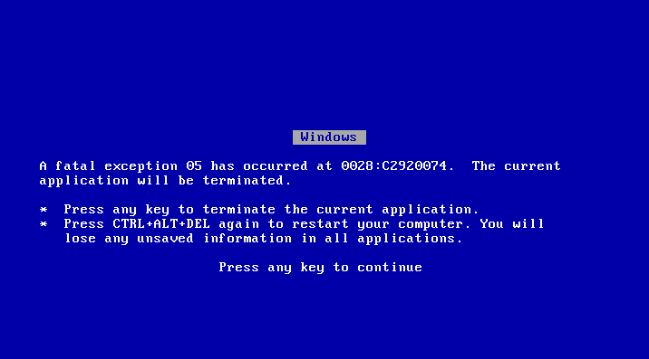
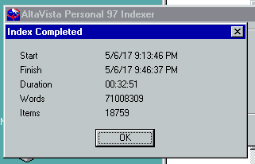
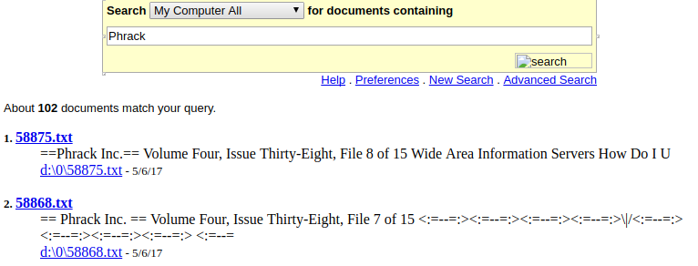
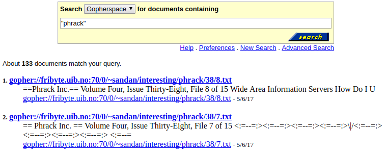
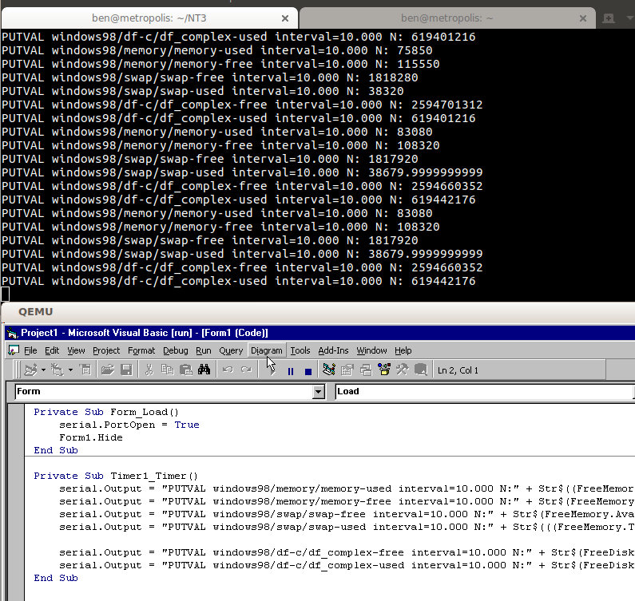
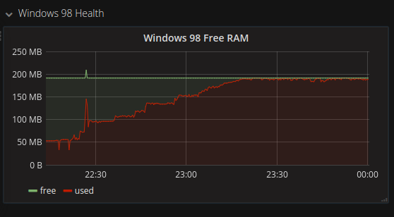
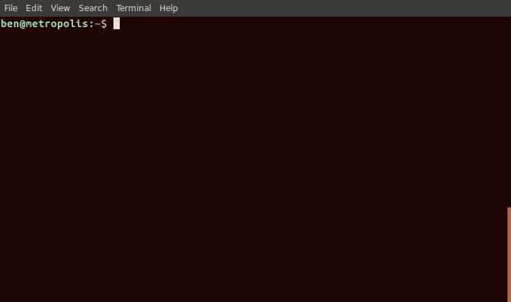

Building a legacy search engine for a legacy protocol
===

Most people using the internet today mostly make use of three protocols, HTTP, TLS, and DNS.

While nowadays HTTP is king, there was once a competing protocol to the one that we know and love.

Located just 10 ports down from HTTP is [Gopher](https://www.ietf.org/rfc/rfc1436.txt), on TCP port 70, which looks a lot like a much more simplistic variant of HTTP/1.0.

While a basic HTTP/1.0 request may look like this:

```

$ nc blog.benjojo.co.uk 80
GET / HTTP/1.0


HTTP/1.1 403 Forbidden
Date: Wed, 03 May 2017 19:11:28 GMT
Content-Type: text/html; charset=UTF-8
Connection: close

```

A gopher request is even more basic:

```
$ echo "/archive" | nc gopher.floodgap.com 70
1Floodgap Systems gopher root	/	gopher.floodgap.com	70
i 		error.host	1
iWelcome to the Floodgap gopher files archive. This contains		error.host	1
imirrors of popular or departed archives that we believe useful		error.host	1
```

This is great for basic file transfers, as basic bash utilities can be used to download files!

However in the end, HTTP won out over gopher and became the protocol that most of us use to do things on the internet. The reasons why are interesting, however others have told that story much better, [and you can find a good write up here](https://www.minnpost.com/business/2016/08/rise-and-fall-gopher-protocol).

Search engines exist for HTTP, and gopher itself has support for searching in the protocol, but all the search engines for gopher are in "gopherspace". None really existed in HTTP (that I could find).

I had a [friend](https://twitter.com/2sec4u) run a [zmap](https://github.com/zmap/zmap) scan over the internet for port 70, and then filtered the results for real gopher servers:

```
[ben@aura tmp]$ pv gopher.raw | grep 'read":"i' | jq .ip | sort -n | uniq -c | wc -l
2.14GiB 0:00:08 [ 254MiB/s] [================>] 100%            
370
```

A sad 370 servers are left on the internet that serve gopher.

## Building a crawler

I wrote a simple RFC1436 implementation and crawler, and slowly (there are very old servers behind some of these hosts) began crawling all the menus, known as selectors, and text files I could find.

At this point I started to explore gopher space itself, and I have to say, it's a wonderful place of just pure content, a far cry away from the modern internet where CSS and adtech are stuffed in every corner.


## Indexing the content

Given that gopher is from the 1990s, it feels only right to use search engine tech from the era. As it happens [AltaVista](https://en.wikipedia.org/wiki/AltaVista) once sold a personal/home version of their search engine for 
desktop computers. The issue however is that it's win32 only software. I didn't try running it on wine, instead I aimed for a more authentic experience of running the software: using a [fantastic guide from NeoZeed](https://virtuallyfun.superglobalmegacorp.com/2017/02/25/personal-altavista-utzoo-reloaded/) I ended up provisioning my very own Windows 98 search "server".

<blockquote class="twitter-tweet" data-lang="en"><p lang="en" dir="ltr">I never thought I be doing this again, and yet, here we are! Join me in the adventures of &quot;oh god we are installing windows 98 again&quot; <a href="https://t.co/Ub83PQ4sV7">pic.twitter.com/Ub83PQ4sV7</a></p>&mdash; Ben Cox (@Benjojo12) <a href="https://twitter.com/Benjojo12/status/860893238831480833">May 6, 2017</a></blockquote>
<script async src="//platform.twitter.com/widgets.js" charset="utf-8"></script>



The search engine works:



As NeoZeed found out, the search interface only listens on loopback (hardcoded), which is very annoying if you want to expose it to the wider world! To solve this [stunnel](https://www.stunnel.org/index.html) 
was deployed to listen on * and relay connections back to the local instance, with added SSL! [Using a pretty questionable (but CT logged) default SSL certificate too](https://crt.sh/?id=130496527) [(A)](http://archive.is/WJNYb)!

## Providing data to the indexer

Because the indexer and backend is a Windows 98 QEMU VM, there has to be a way of giving that VM approximately 5GB of tiny files for the AltaVista indexer to see and include in the index. For this, I chose to make a FAT32 file system every 24 hours as a snapshot of the crawled data, and then restart the crawling VM to see the new files. This worked really quite well in testing with a small amount of files, however a few issues became apparent: first of all FAT32 has file limits that need to be paid attention to. For example, FAT32 is not able to have more than 255 files in the root directory, so you have to be sure to spread out your files in folder structures.

Another issue to keep in mind is that the maximum drive size for FAT32 is 32GB (approx). This means the amount of textual content can't go bigger than that (or we would have to spawn more virtual drives). Fortunately, the size of the crawled content is far below that so this is a non issue.

While crawling a "production size" data set, the system would reset at a random point while running the indexing program:



After tweaking the disk cache settings, a slightly more constructive error was obtained:



This is good! I can search for `exception 05 has occurred at 0028:C2920074`! Right? As it happens, there is very little information about this kind of crash on the internet (it may have existed at some point in the past, but since been removed; after all, the OS is 20 years old), however the one piece of information I could gather from searching is that it was VFAT driver related. Suspecting a bad combo between high IO load and QEMU's [INT_13](https://en.wikipedia.org/wiki/INT_13H) implementation, I went for the only other file system/data input system available, CD/DVD ROM!

After doing a small 500MB test (a test that FAT32 could not pass) we had a small index!



At this point we had to scale up the solution to the 300k / 4 GB of files. I discovered that Windows 98 does support DVDs, even though the UI can only display that the drive is 2GB, even if the drive is much larger than that. Despite that, all content was accessible on the drive and an initial index was (slowly) built.


## Sanitise the index interface

The only problem with using a 20 year old indexer is that it's likely a **very** bad idea to expose directly to the internet. The other issue is that most of the pages the interface serves reference local (as in, `file://`) assets, meaning that a simple reverse proxy would not work.

In addition, local paths are not very useful to people searching. For this `alta-sanitise` was written to provide a sane front end to it, while still keeping the Windows 98 AltaVista index as it's backend.

To do this, I produce a file system containing all the files that were downloaded, and name them by their database ID:



However in alta-sanitise, we use the database we formed using crawling, to rewrite the URLs into something viewable:



To ensure the server powering this project could also be used for other things, lighttpd was put in front as a reverse proxy and currently cached with Cloudflare. (MITM!!!11!)

This leaves the final flow looking like this:


# Monitoring Windows 98

Most of my servers are monitored using collectd. Unfortunately there is no Windows 98 client for collectd (!?), so I decided to make one.

A simple Visual Basic 6 application polls metrics every 10 seconds and outputs [collectd command strings](https://collectd.org/wiki/index.php/Plain_text_protocol#PUTVAL) over the serial port, where they can be passed on to collectd running on the hypervisor:





This code can be found separately at: https://github.com/benjojo/win32-collectd

(Some troubled soul may find this useful outside of a gopher crawler.) 

# Giving back to the community

Now that I have a sizeable index of the gopher space, I feel like I should give back to gopher space:



You can now find my blog on gopher at `gopher.blog.benjojo.co.uk`. 

You can find all of the code for this project over at: https://github.com/benjojo/gophervista
